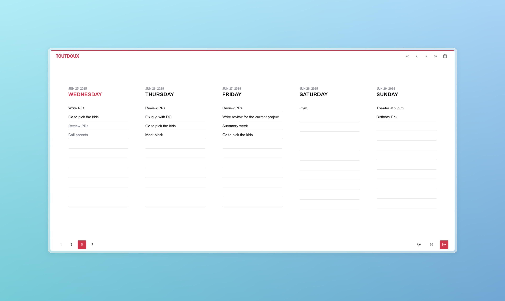

<div align="center">
    <br />
    <h1 align="center">Toutdoux</h1>
    <sub>/tu du/ adjective — (French) very soft.</sub>
</div>

<div align="center">
  <sub>Created by <a href="https://github.com/jgengo">Jordane Gengo</a></sub>
</div>

<br/>

**Toutdoux** is a minimalist, design-focused todo app inspired by TeuxDeux. Built with Next.js 14, TypeScript, and Tailwind CSS.

<br/><br/>

<div align="center">



</div>

## Features

- 🎯 Minimalist task management
- 📱 Responsive design (mobile & desktop)
- 🎨 Clean, animation-rich UI
- 🔐 Google authentication
- 📅 Flexible calendar view (1, 3, 5, or 7 days)
- 💾 Persistent view preferences
- 🌙 Dark mode support

## Tech Stack

- **Framework:** Next.js 14 (App Router)
- **Language:** TypeScript
- **Styling:** Tailwind CSS
- **UI Components:** shadcn/ui
- **Authentication:** NextAuth.js v5
- **Database:** MongoDB with Mongoose
- **Animations:** Framer Motion
- **Icons:** Lucide Icons
- **Forms:** React Hook Form
- **Font:** IBM Plex Sans

## Getting Started

1. Clone the repository:

```bash
git clone https://github.com/jgengo/tout_doux.git
cd tout_doux
```

2. Install dependencies:

```bash
npm install
# or
pnpm install
# or
yarn install
```

3. Create a `.env.local` file in the root directory with the following variables:

```bash
# MongoDB
MONGODB_URI=

# Resend
RESEND_KEY=

# NextAuth
AUTH_SECRET=
GOOGLE_CLIENT_ID=
GOOGLE_CLIENT_SECRET=
```

4. Start the development server:

```bash
npm run dev
# or
pnpm dev
# or
yarn dev
```

5. Open [http://localhost:3000](http://localhost:3000) with your browser to see the result.

You can start editing the page by modifying `app/page.tsx`. The page auto-updates as you edit the file.

